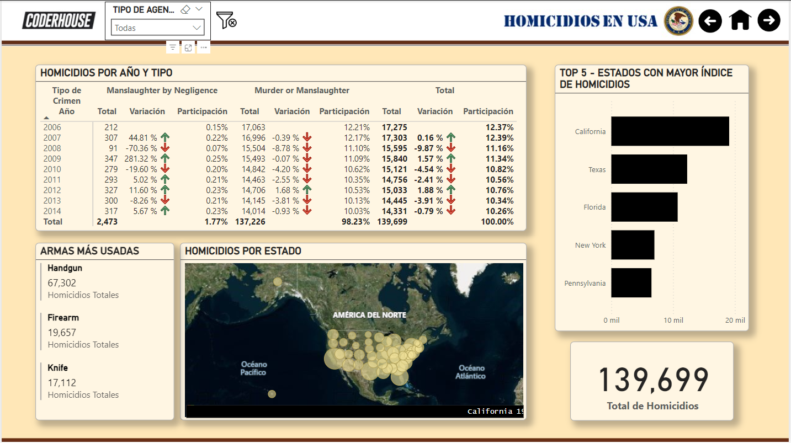
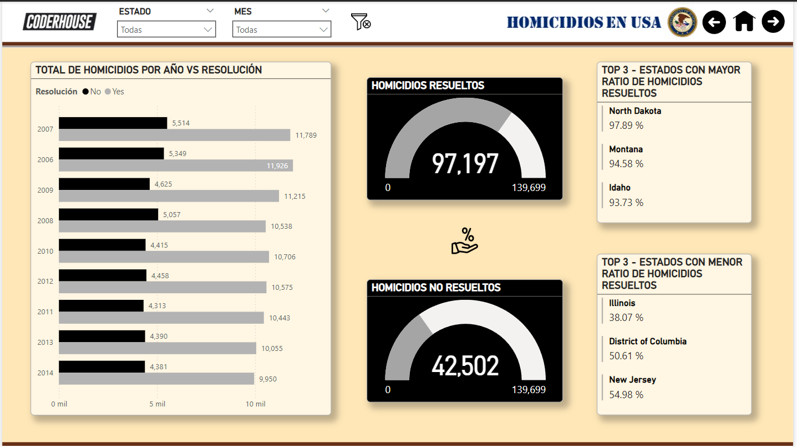
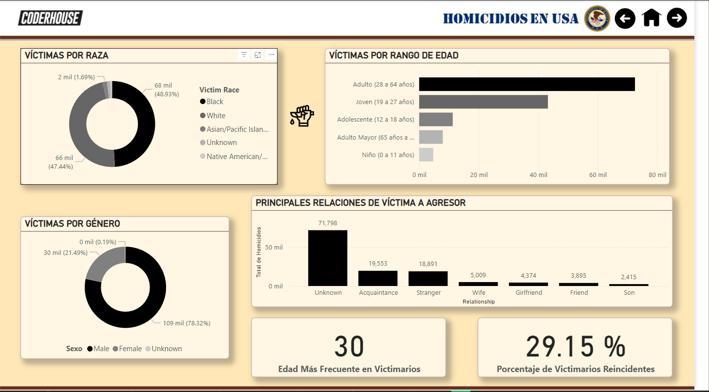
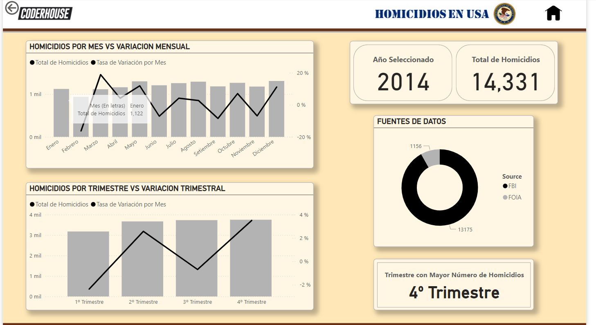

# Reporte de Homicidios
Exploración de un amplio conjunto de datos sobre homicidios en Estados Unidos entre 2006 y 2014. A través del uso de Power BI, se creó un tablero analítico interactivo diseñado para visualizar datos clave como la distribución geográfica, la evolución temporal y los tipos más comunes de homicidios. Además, se analizaron patrones demográficos de víctimas y victimarios, incluyendo edad, raza y género, para identificar relaciones y tendencias significativas. Este enfoque combina técnicas de visualización de datos y análisis estadístico para ofrecer insights accionables que faciliten una comprensión más profunda de las dinámicas de los homicidios en este período.

