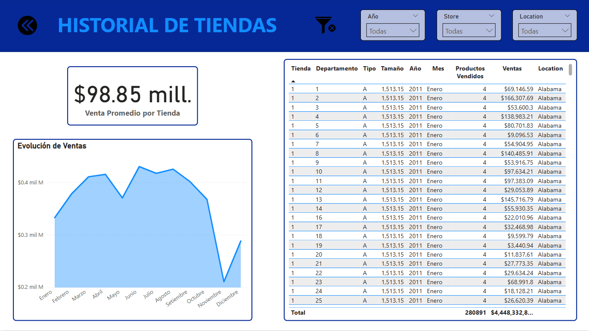
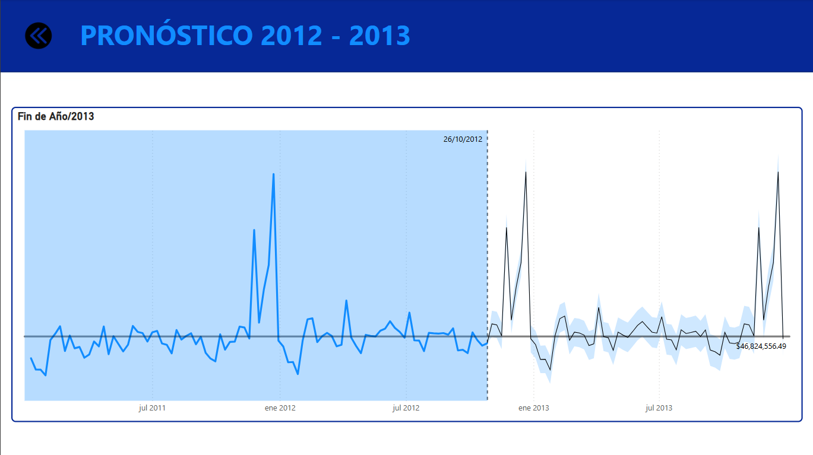
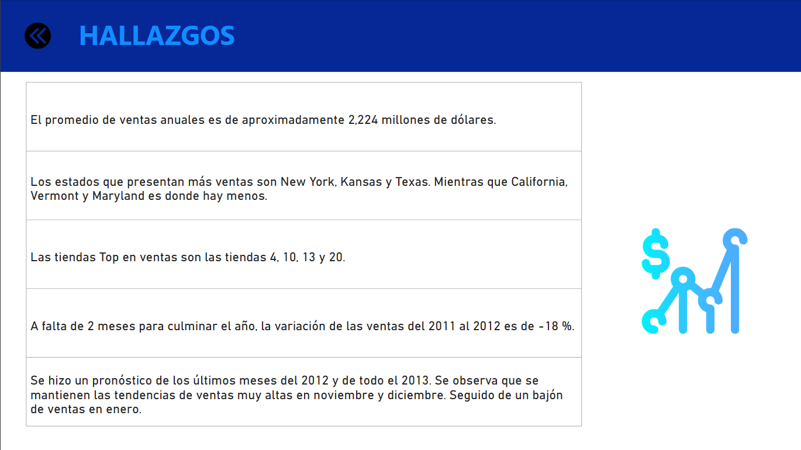

# Reporte de Ventas
El presente proyecto acompaña y describe el dashboard de ventas desarrollado
en Power BI, el cual tiene como propósito principal ofrecer una visión detallada y
actualizada del desempeño comercial de una organización de ventas de retail. A
través de este dashboard, los usuarios pueden acceder a una representación visual
de los datos de ventas, facilitando la identificación de tendencias, patrones y áreas
de oportunidad. Este informe no solo resume los hallazgos clave del análisis
realizado, sino que también explica la lógica detrás de las visualizaciones y los
filtros implementados en el dashboard. Además, se detallan las fuentes de datos
utilizadas, los indicadores de rendimiento clave (KPI) seleccionados, y se ofrecen
recomendaciones basadas en los insights obtenidos.

[Informe en PDF](ReporteVentas.pdf)

[Archivo Power BI](ProyectoVentas.pbix)