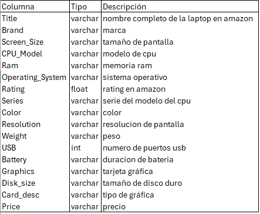
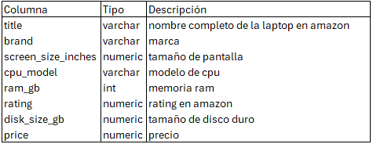

# Proyecto de Limpieza de Datos de Laptops

Descripción: Este proyecto tiene como objetivo limpiar y preparar los datos de laptops para su posterior análisis. Los datos originales contienen varias inconsistencias y valores faltantes que deben ser tratados. 

<<<<<<< HEAD
Tabla original:

Tabla limpia:

Resultados: Después de la limpieza, se corrigieron y eliminaron diferentes columnas, y se eliminaron alrededor de 1200 filas que contenían ya sea datos nulos o innecesarios para un análisis.

Para más detalles, aquí el [código.](Laptops-datacleaning.sql)

Fuente de datos: https://www.kaggle.com/datasets/jenilhareshbhaighori/real-world-laptop-data-analysis?select=laptop_uncleaned.csv