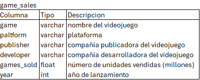
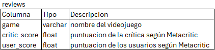

# Proyecto de Análisis de Videojuegos con SQL

Descripción: EEste proyecto tiene como objetivo analizar datos históricos de videojuegos utilizando SQL, para extraer insights sobre el comportamiento del mercado y la calidad de los títulos en distintos años.

Tablas:
  

Fuente: https://www.kaggle.com/datasets/holmjason2/videogamedata