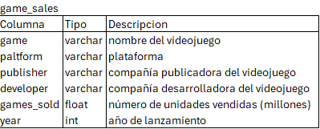
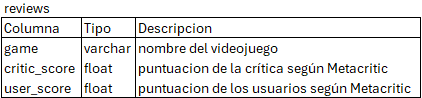

# Proyecto de Análisis de Videojuegos con SQL

Descripción: Este proyecto tiene como objetivo analizar datos históricos de videojuegos utilizando SQL, para extraer insights sobre el comportamiento del mercado y la calidad de los títulos en distintos años.

Tablas:

  

**Hallazgos Relevantes:**
- Valoraciones Críticas:
Los años con mejores valoraciones fueron 1998, 1999, 2001, 2002, 2003, 2004, 2010 y 2014, destacándose 2010 con aproximadamente 676 millones de unidades en términos de valoración.

- Ventas:
El año 2008 registró las mayores ventas, alcanzando 734 millones de unidades, a pesar de no contar con las mejores reseñas.

- Plataformas:
Sony destacó durante este periodo, con consolas como PlayStation y PlayStation 2. En concreto, PlayStation 2 fue la plataforma con mayor cantidad de videojuegos vendidos, seguida por la PC y Xbox 360.

[Ver PPT.](Portfolio/SQL/VideogameAnalysis/AnalisisdeVideojuegos.pptx)

[Ver Código SQL.](Portfolio/SQL/VideogameAnalysis/video_games_analysis.sql)

Fuente: https://www.kaggle.com/datasets/holmjason2/videogamedata
